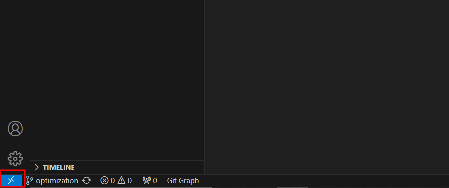
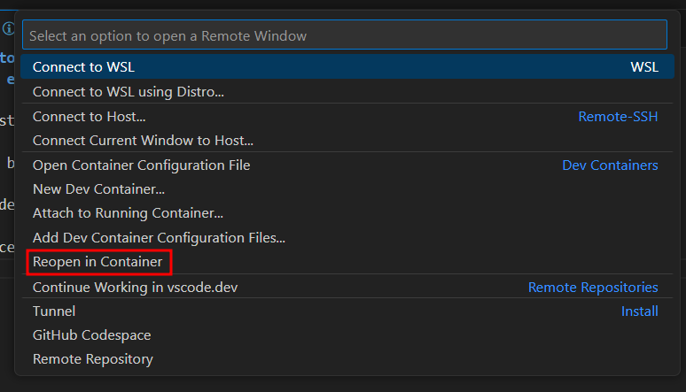

# Proyecto RAG
### Cómo ejecutar en un dev container

Importante: tener un archivo .env en la raiz del proyecto.

1- Tener instalado la extension de dev containers

2- Click en boton azul abajo a la izquierda de vs code, "reabrir en contenedor"
imagen

3- Adentro del contenedor, se puede usar el debugger de python para correr la aplicacion de chainlit.

4- Si se hacen cambios en el compose, al entrar en el dev container, se debe volver a tocar en el boton azul y clickear "reconstruir contenedor".
Para salir del dev container, reabrir carpeta local

